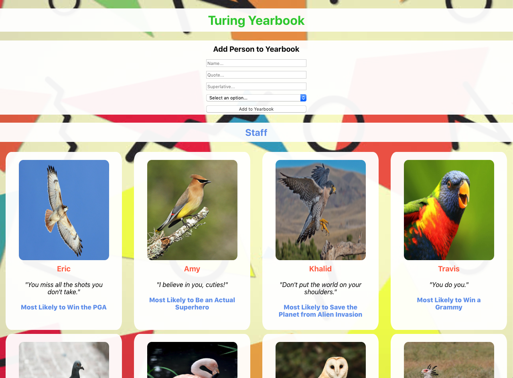

# Turing Yearbook
## By David Engel

This is my first solo project in module 3 at the Turing School of Software & Design.  The assignment was to use React to create a simple yearbook application that pulls information from a database and displays them on the DOM.  Since this is our first time using React, the objectives of the assignment were to:

1)  Write squeaky clean, well refactored code using ES6 syntax.
2)  Learn to pass information between components using props.
3)  Learn to write readable JSX (render methods/return statements should be clean and simple).

Here are the full list of requirments for this project:

#### Iteration 0

Get set up (per the instructions above)!

We've provided a boilerplate for you to work with. Look through the file structure to get a sense of the app.

Notice that we have multiple stylesheets - one for each component. You are welcome to style this application however you'd like. We got you started with a little styling, but feel free to get creative. (Remember, though - most of your energy should be spent on learning React, not styling.)

#### Iteration 1

Create a Cohort component, which will act as a container that renders each of our Person cards. For now, the Cohort being displayed will be "Staff". Figure out how to pass information from `App.js` to `Cohort.js`!

#### Iteration 2

Create a Person component. Each Person card will display: the image, the name, the quote, and the superlative (see the screenshot above for an idea).

In your Cohort component, create Person cards that have the information each needs to display properly.

#### Iteration 3 (extension - do not attempt until iterations 0 - 2 are completed)

In the `yearbook-data.js` file, un-comment-out the "students" information. Get that information displaying, too. How can you reuse components?

#### Iteration 4 (extension - do not attempt until iterations 0 - 3 are completed)

Create a controlled component that allows people to add a new student.

### Set Up

Clone down this repo.

Navigate to the root directory in your terminal and run "npm start"

Experiment with the form and check out all of the yearbook enteries!

### Screen shots

